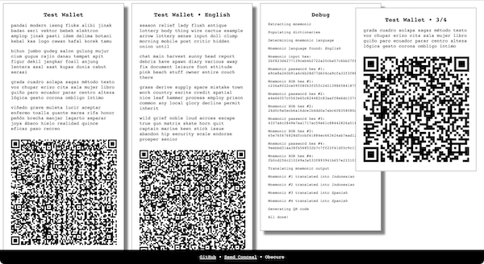
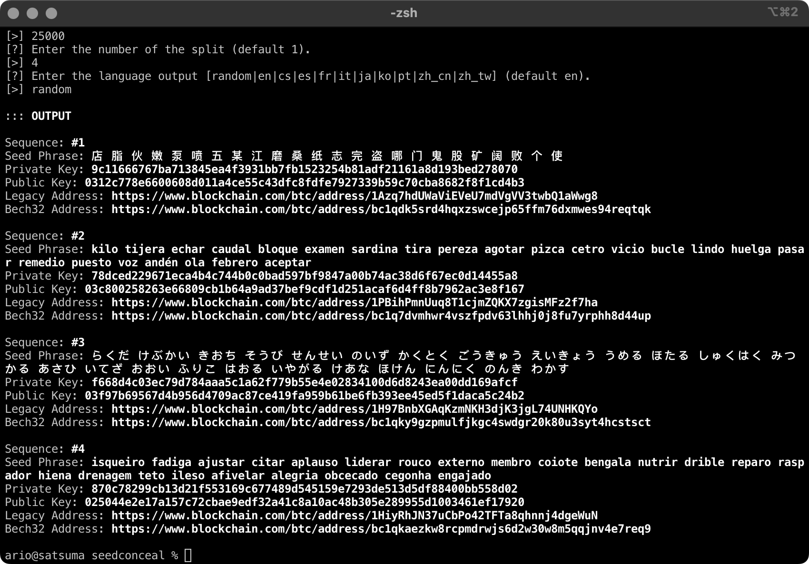

# SeedConceal

SeedConceal is a simple set of tools to generate a wallet seed phrase (random or deterministic), obscure an existing seed phrase, and reveal obscured seed phrases.

## Requirements

- [PHP 7.4+ or 8+](https://www.php.net/)
- [Composer 2+](https://getcomposer.org/)

## Usage

```
git clone https://github.com/rarioj/seedconceal.git
cd seedconceal
composer install
```

### Disable your internet connection before generating, obscuring, or revealing seed phrases.

By creating an air-gapped system, you can guarantee that your operating system will not interact with anything on the internet. You can reenable the internet once your seed phrases are securely stored.

#### Web Mode



```
cd web
php -S localhost:9000
```

Open a web browser and then go to `http://localhost:9000/`. You can adjust the port number to suit your need.

On the web version, clicking on the generated seed phrases or the QR codes will allow you to capture the seed phrase card and save it as an image.

#### CLI Mode



```
php cli/generate.php
php cli/obscure.php
php cli/reveal.php
```

Follow the interactive prompt for each tool.

## Tools

### Generate

This tool generates a valid seed phrase for a wallet using a deterministic or random approach. Only use this tool if you plan to create a new wallet or divulge a deterministic wallet seed phrase by entering all the required parameters.

When generating a new wallet, leaving the passphrase field blank will let you use PHP's secure [random_bytes()](https://www.php.net/manual/en/function.random-bytes.php) function.

For a deterministic approach, first, understand the risk of generating this type of wallet. See the [Speed Optimizations in Bitcoin Key Recovery Attacks](https://eprint.iacr.org/2016/103.pdf) paper. Ensure the passphrase used is unique, private, and never exposed on the internet. Using a password will reduce the attack vector by [XOR-ing](https://www.php.net/manual/en/function.gmp-xor.php) hashed passphrase and password. The [hash salt and the number of iterations](https://www.php.net/manual/en/function.hash-pbkdf2.php) are essential when revealing the original mnemonic.

### Obscure

This tool can obscure your existing wallet mnemonic by securing it with a password, splitting it into multiple seed phrases, and translating it to other languages. Use this tool if you plan to conceal an existing seed phrase.

- **Securing with password:** Using a password will add additional security measures by [XOR-ing](https://www.php.net/manual/en/function.gmp-xor.php) private key and the hashed password. The [hash salt and the number of iterations](https://www.php.net/manual/en/function.hash-pbkdf2.php) are critical when revealing the original seed phrase.

- **Splitting seed phrase:** You can split an existing mnemonic into multiple seed phrases. The order of the generated seed phrases does not matter as long as you have all the mnemonic pieces. PHP's secure [random_bytes()](https://www.php.net/manual/en/function.random-bytes.php) function is used to produce the combined [XOR-ed](https://www.php.net/manual/en/function.gmp-xor.php) values. The same seed phrase will generate a different set of split mnemonics every time.

- **Translating seed phrases:** You can translate obscured seed phrases into different languages. A standard set of [alternative languages besides English](https://github.com/bitcoin/bips/blob/master/bip-0039/bip-0039-wordlists.md) is available. See [BIP39](#bip39) section for more information.

### Reveal

This tool does the opposite of obscure. It reveals translated, split, and password-protected seed phrases. All parameters used when obscuring mnemonic are required when revealing the original seed phrase (which includes hash salt, number of iterations, and password).

## Examples

### Example 1: Generating a deterministic seed phrase

Parameters:

- Passphrase: `I love Bitcoin`
- Salt: `satoshi nakamoto`
- Iteration: `10000`
- Password: `ObscureMe!`
- Byte size: `32` (24 words mnemonic)

Generated seed phrase:

```
sword oak page attack venture mountain ramp treat heavy level obscure resemble surround coach leaf comfort boat nuclear bunker minor picnic exhaust embark roof
```

### Example 2: Obscuring an existing seed phrase

Parameters:

- Seed phrase: `sword oak page attack venture mountain ramp treat heavy level obscure resemble surround coach leaf comfort boat nuclear bunker minor picnic exhaust embark roof`
- Password: `ObscureMe!`
- Salt: `genesis block`
- Iteration: `25000`
- Split into: `4`
- Language: `random`

Generated seed phrases:

```
熊 鬼 都 賣 遍 冶 往 必 弄 點 審 號 錠 君 偶 溪 行 魯 篇 式 溝 嘆 功 子
zamotat anketa masopust povstat pikle rachot matrika montovat dnes nadobro kapalina okrasa emise svatba klec pianista nejprve sobota mazanec zdivo ofina nominace otrhat lepenka
ながい みりょく おどり べんごし ぬめり ていさつ おかわり おくじょう りきせつ すあな へいてん うなる そせい すいようび ひんしゅ みのう すらすら こすう さみしい うれしい かなざわし ねむい あずかる てつづき
climat blanchir nation exaucer glorieux coffre dossier sevrage éclore peigne fureur bronzer rivière taureau voguer trahir aisance muter sonde géomètre femme annuel biopsie fragile
```

### Example 3: Revealing obscured seed phrases

Parameters:

- Seed phrase(s):

```
ながい みりょく おどり べんごし ぬめり ていさつ おかわり おくじょう りきせつ すあな へいてん うなる そせい すいようび ひんしゅ みのう すらすら こすう さみしい うれしい かなざわし ねむい あずかる てつづき
熊 鬼 都 賣 遍 冶 往 必 弄 點 審 號 錠 君 偶 溪 行 魯 篇 式 溝 嘆 功 子
climat blanchir nation exaucer glorieux coffre dossier sevrage éclore peigne fureur bronzer rivière taureau voguer trahir aisance muter sonde géomètre femme annuel biopsie fragile
zamotat anketa masopust povstat pikle rachot matrika montovat dnes nadobro kapalina okrasa emise svatba klec pianista nejprve sobota mazanec zdivo ofina nominace otrhat lepenka
```
- Password: `ObscureMe!`
- Salt: `genesis block`
- Iteration: `25000`

Revealed seed phrase (same mnemonic as Example 2):

```
sword oak page attack venture mountain ramp treat heavy level obscure resemble surround coach leaf comfort boat nuclear bunker minor picnic exhaust embark roof
```

## BIP39

[BIP39](https://github.com/bitcoin/bips/blob/master/bip-0039.mediawiki) describes the implementation of a mnemonic code or mnemonic sentence, a group of easy-to-remember words, for the generation of deterministic wallets.

You can add custom wordlists as a plain text file in the `app/bip39` directory and then register as a new language in the `app/config.php` file. Please ensure to **back up your custom wordlists file** if you do so. Custom wordlists must follow the rules and recommendations described [on this page](https://github.com/bitcoin/bips/blob/master/bip-0039.mediawiki).

[Wordlists files](https://github.com/bitcoin/bips/blob/master/bip-0039/bip-0039-wordlists.md) available:

- [Czech](https://github.com/bitcoin/bips/blob/master/bip-0039/czech.txt) - `bip39/cs.txt`
- [English](https://github.com/bitcoin/bips/blob/master/bip-0039/english.txt) - `bip39/en.txt` **(default)**
- [Spanish](https://github.com/bitcoin/bips/blob/master/bip-0039/spanish.txt) - `bip39/es.txt`
- [French](https://github.com/bitcoin/bips/blob/master/bip-0039/french.txt) - `bip39/fr.txt`
- [Italian](https://github.com/bitcoin/bips/blob/master/bip-0039/italian.txt) - `bip39/it.txt`
- [Japanese](https://github.com/bitcoin/bips/blob/master/bip-0039/japanese.txt) - `bip39/ja.txt`
- [Korean](https://github.com/bitcoin/bips/blob/master/bip-0039/korean.txt) - `bip39/ko.txt`
- [Portuguese](https://github.com/bitcoin/bips/blob/master/bip-0039/portuguese.txt) - `bip39/pt.txt`
- [Chinese (Simplified)](https://github.com/bitcoin/bips/blob/master/bip-0039/chinese_simplified.txt) - `bip39/zh_cn.txt`
- [Chinese (Traditional)](https://github.com/bitcoin/bips/blob/master/bip-0039/chinese_traditional.txt) - `bip39/zh_tw.txt`

## Libraries

- [bitwasp/bitcoin](https://github.com/Bit-Wasp/bitcoin-php): Bitcoin library for PHP.
- [html2canvas](https://html2canvas.hertzen.com/): Capture a container in a document as an image for the web version.
- [milon/barcode](https://github.com/milon/barcode): Generate QR code for the web version.

###### Check out my [Starname](https://app.starname.me/profile/*rarioj) profile and buy me a ☕ or 🍺.
