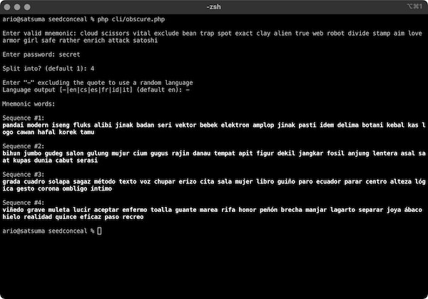

# Seed Conceal

Seed Conceal is a simple set of tools to **Generate** a wallet mnemonic, **Obscure**/split them with a secret password, and **Reveal** obscured seed phrase(s).

## Tools

### Generate

This tool generates a valid mnemonic (seed phrase) for a multi-coin wallet. If you are creating a new wallet, you can use this tool to produce a new mnemonic. Select between 12 or 24 words mnemonic. You can import the generated mnemonic to your favourite BIP39 compatible crypto wallet. See [BIP39](#bip39) section for more information.

For the web version, clicking on the generated words or the QR code will allow you to capture the seed phrase card and save it as an image.

### Obscure

This tool obscures your wallet seed phrase with a secret password (and splits them if desired). You can use an existing mnemonic from your active wallet and conceal it.

Three layers of security can be applied when concealing seed phrases:

- **Password protection (required):** Obscured seed phrase with the password protection feature will generate a new valid mnemonic (which most likely will be an empty wallet). The only way to **Reveal** the original mnemonic is by using this password.

> Make sure to remember your password.

- **Splitting mnemonic (optional):** You can split the original mnemonic into multiple seed phrases (which all are equally valid and will likely point to empty wallets). The order of the seed phrases is critical when **Reveal**-ing your original wallet.

> Record the mnemonic sequence as well.

- **Translating mnemonic (optional):** You can translate obscured mnemonics into different languages. A standard set of alternative languages besides English is available. You can add your custom wordlists by creating a plain text file with all the 2048 words supplied. See [BIP39](#bip39) section for more information.

> Make sure your custom wordlists files are backed up.

For the web version, clicking on the generated words or the QR code will allow you to capture the seed phrase card and save it as an image.

### Reveal

This tool reveals split, translated, and password-protected seed phrases. For a split mnemonic, enter the seed phrases in the proper order given by the **Obscure** output above (separated by a new line).

For the web version, clicking on the generated words or the QR code will allow you to capture the seed phrase card and save it as an image.

## Requirements

- [PHP 7.4+ or 8+](https://www.php.net/)
- [Composer 2+](https://getcomposer.org/)

## Usage

Clone this project and run the following commands:
```
git clone https://github.com/rarioj/seedconceal.git
cd seedconceal
composer install
```

**WARNING:** For best security practice, **DISABLE YOUR INTERNET CONNECTION** before *generating*, *obscuring/splitting*, or *revealing* seed phrases (air-gapped system). You can reenable the internet once your seed phrases are securely stored.

### Web


```
cd web
php -S localhost:9000
```

Open a web browser and then go to `http://localhost:9000/`. You can adjust the port number to your need.

### CLI



```
# Run generate tool
php cli/generate.php

# Run obscure tool
php cli/obscure.php

# Run reveal tool
php cli/reveal.php
```

Follow the interactive input prompt for each tool.

## Examples

Several examples using Seed Conceal. Feel free to use these examples as a test.

### Example 1: Password protected; no split; no translation

Generated 24 words mnemonic:

`liberty essay coral into wing ceiling pulp obscure harvest pond smoke birth horn skate lunch harsh lunch slogan news canvas adjust scorpion grace plunge`

Obscured with password `ObscureMe!`:

`valve trap report mouse nurse unique number match brief hope human machine cause awake oven oven blood expire sight nothing invest add letter input`

Revealed seed phrase by entering the above mnemonic and the password:

`liberty essay coral into wing ceiling pulp obscure harvest pond smoke birth horn skate lunch harsh lunch slogan news canvas adjust scorpion grace plunge`

### Example 2: Password protected; split into three; random translation

Generated 12 words mnemonic:

`alcohol sweet wool easily script lumber three begin satoshi timber aerobic bitter`

Obscured with password `ObscureMe!`, split into 3, using random language translation:

Split mnemonic #1 (Indonesian)

`grup moral serpih makin marga butuh gagah mujur takar tertib epoksi perisai`

Split mnemonic #2 (Spanish)

`lámpara mamut juzgar pauta amante repetir ronco asistir tiza paloma lista historia`

Split mnemonic #3 (Italian)

`ruolo aragosta dedicato omissione movimento dentro vitello fortezza apatico verruca ridurre finanza`

Revealed seed phrase by entering the above mnemonics in sequence and the password:

`alcohol sweet wool easily script lumber three begin satoshi timber aerobic bitter`

### Example 3: Password protected; split into two; French translation

Generated 24 words mnemonic:

`olympic blur derive clip mandate harvest lake question rack put turkey media enable pass wide spirit crystal admit all toe imitate circle once approve`

Obscured with password `ObscureMe!`, split into 2, using French language translation:

`tissu papoter polygone résultat tiède mouvant dimanche poteau prodige fédérer domicile banlieue abdiquer histoire station cadeau nuancer méconnu étagère enlever affiche tiède implorer reprise`

`éprouver enzyme poumon éduquer soucieux vaillant infliger rompre école jambe unitaire goudron pourpre viseur glorieux justice zeste mobile ovation suricate tarif causer douter uranium`

Revealed seed phrase by entering the above mnemonics in sequence and the password:

`olympic blur derive clip mandate harvest lake question rack put turkey media enable pass wide spirit crystal admit all toe imitate circle once approve`

## BIP39

[BIP39](https://github.com/bitcoin/bips/blob/master/bip-0039.mediawiki) describes the implementation of a mnemonic code or mnemonic sentence, a group of easy-to-remember words, for the generation of deterministic wallets.

You can add your wordlists as a plain text file in the `bip39` directory and then adjust the `config.php` file to list the new wordlists file. Please ensure to back up your custom wordlists if you do so.

For the characteristics of a valid mnemonic word, visit [What is BIP39 mnemonic phrase?](https://getcoinplate.com/blog/what-is-bip39-mnemonic-phrase-2022-update/).

Wordlists files provided:

- [English](https://github.com/bitcoin/bips/blob/master/bip-0039/english.txt) - `bip39/en.txt` (default)
- [Czech](https://github.com/bitcoin/bips/blob/master/bip-0039/czech.txt) - `bip39/cs.txt`
- [Spanish](https://github.com/bitcoin/bips/blob/master/bip-0039/spanish.txt) - `bip39/es.txt`
- [French](https://github.com/bitcoin/bips/blob/master/bip-0039/french.txt) - `bip39/fr.txt`
- [Indonesian](https://github.com/Adiset/Mnemonik-Bahasa-Indonesia/blob/master/Mnemonik.txt) - `bip39/id.txt`
- [Italian](https://github.com/bitcoin/bips/blob/master/bip-0039/italian.txt) - `bip39/it.txt`

## Libraries

- [bitwasp/bitcoin](https://github.com/Bit-Wasp/bitcoin-php): Bitcoin library for PHP.
- [html2canvas](https://html2canvas.hertzen.com/): Capture mnemonic and QR code as an image for the web version.
- [milon/barcode](https://github.com/milon/barcode): Generate QR codes for the web version.
